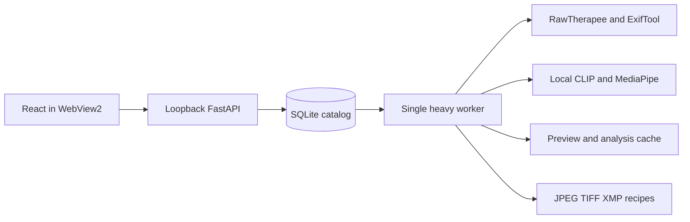

# Architecture

OpenPhoto is a local Windows desktop application. React runs inside pywebview/WebView2, talks to a loopback FastAPI server, and displays results produced by one on-demand heavy worker. SQLite stores the project catalog, versioned edits, and durable jobs.

## Code map

| Area | Files under src/openphoto unless stated | Responsibility |
|---|---|---|
| Desktop lifecycle | `__main__.py`, `desktop.py` | Reserve a local port, open WebView2, flush edits before close, switch projects |
| API | `api.py`, `schemas.py` | Authentication, validation, catalog reads, revision-aware commands |
| Project data | `database.py`, `migrations/`, `projects.py` | SQLite transactions, migrations, backups, independent restore |
| Processing | `service.py`, `workflows.py`, `job_lifecycle.py` | Queueing, checkpoints, pause/retry, workflow stages, recovery |
| Worker ownership | `processes.py`, `locking.py` | One heavy worker, process-tree cleanup, project and job locks |
| Imaging | `imaging.py`, `references.py` | RAW development, ICC conversion, shared preview/export math, retouching |
| Intelligence | `analysis.py`, `selection.py`, `learning.py` | Features, inference, recommendations, pairwise preferences |
| Files | `exports.py`, `cache.py` | Exclusive export names, commit receipts, cache leases |
| Interface | `frontend/src/` | Catalog, editor, jobs, projects, workflow controls |

## Data and processing rules

Original images remain in their imported folders. The project stores paths, metadata, references, recipes, decisions, and job state. Removing a card does not delete the source. Catalog backups do not replace backups of originals.

Recipes are versioned. A render and export must use the same oriented canvas, normalized crop coordinates, masks, and color transforms. New RAW recipes preserve highlight headroom in float32 intermediate TIFFs; final exports can be 16-bit TIFF. Changes to the engine, model manifest, ICC profiles, or processing mathematics must not silently reinterpret old recipes.

`WorkerSupervisor` starts **one heavy worker** when jobs are queued and retires it after inactivity. Interactive work is prioritized at safe boundaries; a full-resolution operation already in progress is not preempted mid-frame. Interrupted jobs return paused, with checkpoints available for continuation.

An export freezes its selection and recipe revisions. Each output bundle reserves names, stages files, records identities, then publishes them. Cleanup only removes files owned by that job. A restored catalog receives independent job identities so it cannot clean an original project's active exports.

## AI and language boundaries

Weights load only after matching the bundled SHA-256 manifest. CLIP may use the GPU; geometry models use the CPU. Uncertain detection must not be represented as a confident recommendation. Automatic cropping remains guarded. Personalization uses shoot-level holdouts and has bounded influence after promotion.

UI strings and many backend messages are currently hardcoded in Russian. There is no localization catalog or language selector. An English UI requires extracting both frontend strings and user-facing backend errors; see the [roadmap](ROADMAP.md).

There is no SaaS backend, Docker service, external vector database, or cloud inference in this architecture. Network preparation is explicit in installation scripts. See [SECURITY](../SECURITY.md) for trust boundaries.
